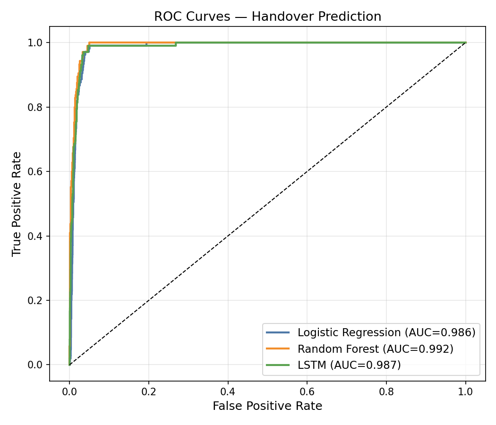
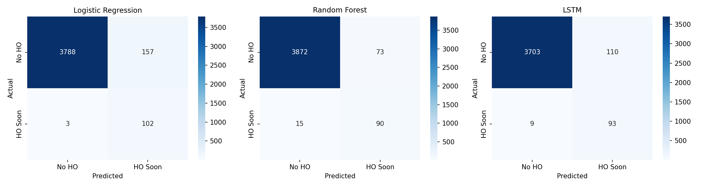

# Intelligent Handover Prediction in LTE Networks using ML

A full machine-learning pipeline that predicts **imminent handover events** (`handover_soon`) in LTE networks from simulated UE radio measurements.

---

## Project Overview

| Item | Detail |
|------|--------|
| Task | Binary time-series classification |
| Label | `handover_soon = 1` if a handover occurs in the next 3 steps |
| Dataset | 27,000 rows · 15 UEs · 1,800 s simulation |
| Models | Logistic Regression · Random Forest · LSTM |
| Best model | Random Forest (F1 = 0.574, ROC-AUC = 0.981) |

---

## Repository Structure

```
lte_handover_prediction/
│
├── simulate.py              # Phase 1 — LTE network simulation
├── run_pipeline.py          # Master runner (phases 2-4)
├── requirements.txt
│
├── data/
│   ├── raw/dataset.csv      # 27k-row simulated dataset
│   └── processed/           # train/val/test splits + meta.json
│
├── src/
│   ├── features.py          # Phase 2 — feature engineering
│   ├── models.py            # Phase 3 — LR, Random Forest, LSTM
│   └── evaluate.py          # Phase 4 — metrics, ROC, confusion matrix
│
├── notebooks/
│   ├── 01_data_generation.ipynb
│   ├── 02_feature_engineering.ipynb
│   ├── 03_modeling.ipynb
│   ├── 04_evaluation.ipynb
│   └── 05_dashboard_preview.ipynb
│
├── models/                  # Saved model artifacts (.pkl / .pt)
├── reports/                 # Evaluation report + plots
└── app/
    └── dashboard.py         # Phase 5 — Streamlit dashboard
```

---

## Quickstart

```bash
# 1. Clone
git clone https://github.com/SouhailBourhim/Intelligent-Handover-Prediction-LTE.git
cd Intelligent-Handover-Prediction-LTE/lte_handover_prediction

# 2. Create environment
python3 -m venv .venv && source .venv/bin/activate
pip install -r requirements.txt

# 3. Generate dataset
python simulate.py

# 4. Run full pipeline (feature engineering → training → evaluation)
python run_pipeline.py

# 5. Launch dashboard
streamlit run app/dashboard.py
```

Or run individual phases:

```bash
python run_pipeline.py --phase 2   # feature engineering only
python run_pipeline.py --phase 3   # training only
python run_pipeline.py --phase 4   # evaluation only
```

---

## Phases

### Phase 1 — Data Generation (`simulate.py`)

Simulates a 1000×1000 m LTE network:
- **4 base stations** at symmetric grid positions
- **15 UEs** — 8 pedestrian (1–2 m/s) + 7 vehicle (10–20 m/s)
- **Radio model:** 3GPP TR 25.814 urban macro path loss + shadow fading (σ = 2 dB)
- **Handover trigger:** A3 event — `RSRP_neighbor > RSRP_serving + 3 dB` for TTT = 3 steps
- **Label:** `handover_soon = 1` if a handover occurs in the next K = 3 steps (no leakage)

Signal ranges: RSRP −73…−30 dBm · SINR −19…+30 dB · RSRQ −19…−3 dB · CQI 1–15

### Phase 2 — Feature Engineering (`src/features.py`)

From 16 raw columns → **71 features**:

| Type | Examples |
|------|---------|
| Lag (t−1, t−2, t−3) | `rsrp_serving_lag1`, `sinr_lag3` |
| Rolling mean (3 s, 5 s) | `rsrp_serving_roll5_mean` |
| Rolling std | `sinr_roll3_std` |
| Delta | `rsrp_serving_delta3` |
| Domain | `rsrp_diff` = neighbor − serving |

Temporal 70/15/15 split · StandardScaler fit on train only.

### Phase 3 — Modeling (`src/models.py`)

| Model | Key settings |
|-------|-------------|
| Logistic Regression | C=0.5, saga solver, class_weight |
| Random Forest | 300 trees, max_depth=12, class_weight |
| LSTM | 2 layers × 64 hidden, seq_len=10, WeightedRandomSampler |

### Phase 4 — Evaluation (`src/evaluate.py`)

| Model | Precision | Recall | F1 | ROC-AUC |
|-------|-----------|--------|----|---------|
| Logistic Regression | 0.305 | 0.919 | 0.457 | 0.979 |
| **Random Forest** | **0.460** | **0.766** | **0.574** | **0.981** |
| LSTM | 0.420 | 0.784 | 0.547 | 0.939 |

**Random Forest** wins on F1 and AUC. **Logistic Regression** maximises recall at the cost of false positives. **LSTM** is competitive and benefits from native sequence modelling.

### Phase 5 — Dashboard (`app/dashboard.py`)

Interactive Streamlit app with:
- Real-time KPI charts (RSRP, SINR, RSRQ, CQI) with handover markers
- Handover event timeline
- Per-UE risk heatmap + gauge
- UE mobility map with BS positions
- Model comparison table

---

## Results




---

## Requirements

- Python 3.10+
- pandas · numpy · scikit-learn · torch · streamlit · plotly · seaborn · joblib

See [`requirements.txt`](requirements.txt) for pinned versions.

---

## Author

**Souhail Bourhim** — LTE network simulation + ML pipeline
